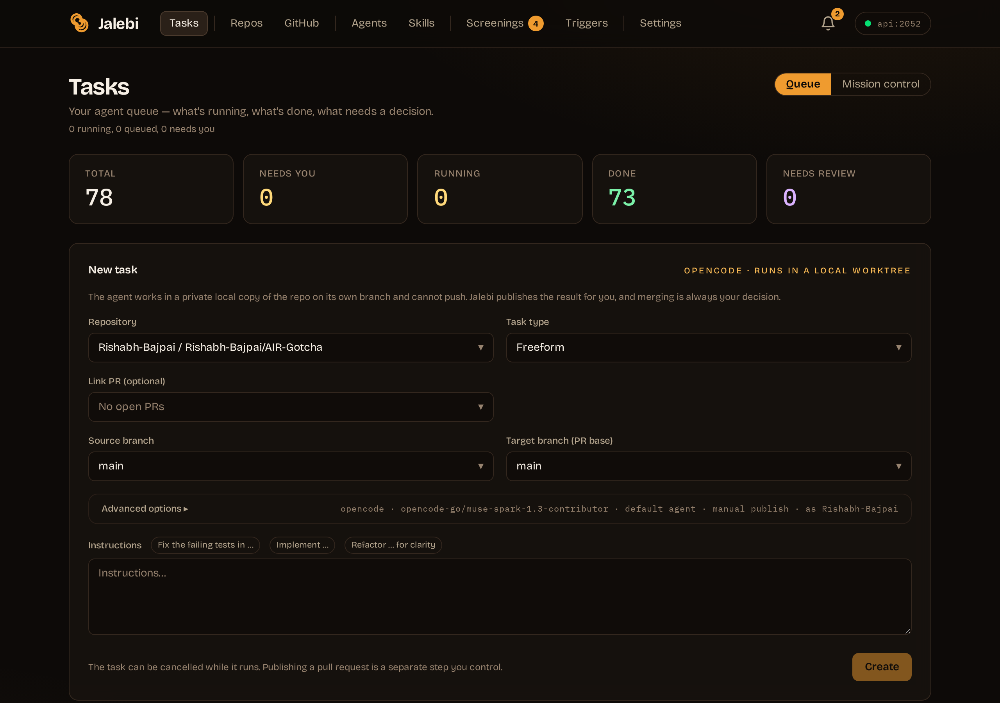
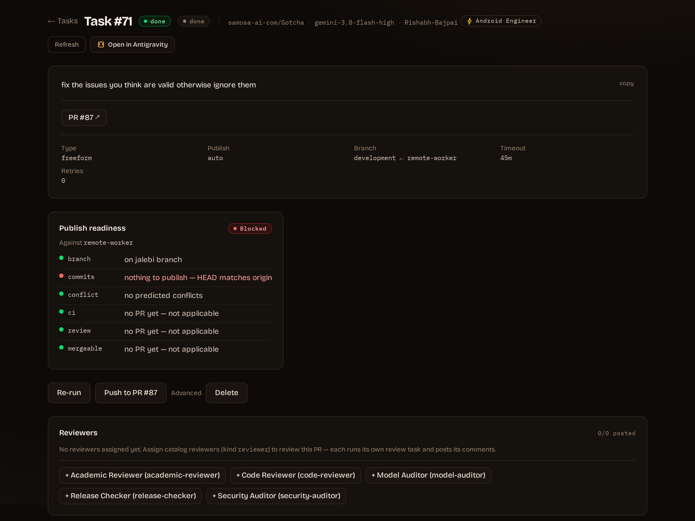
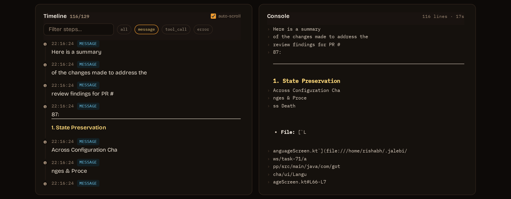
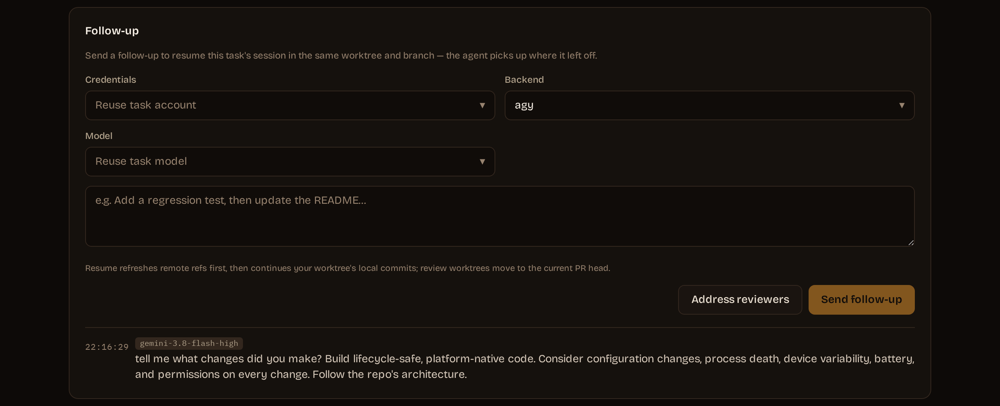
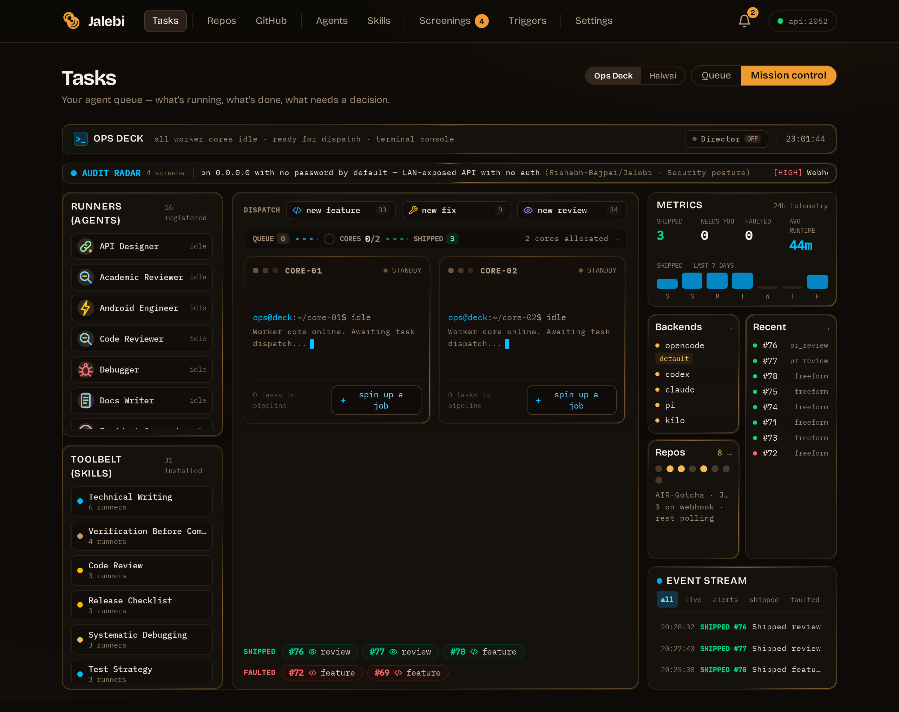
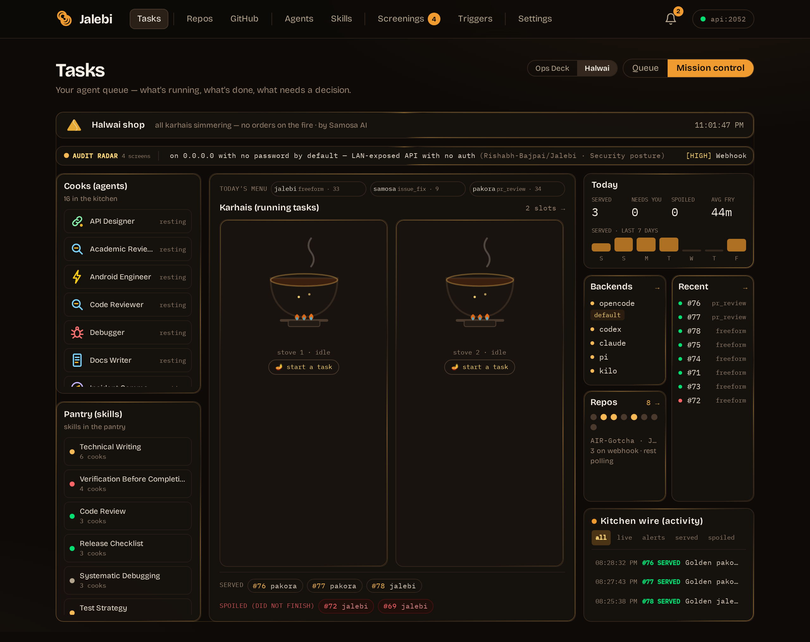
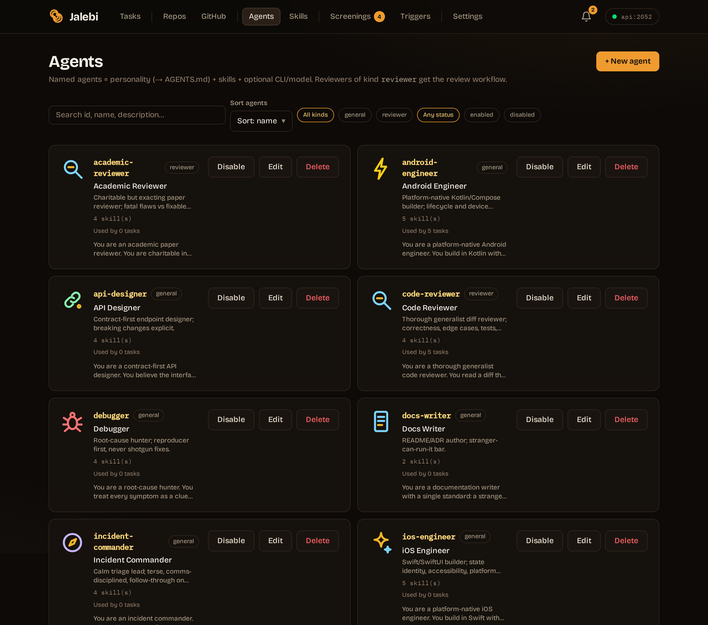
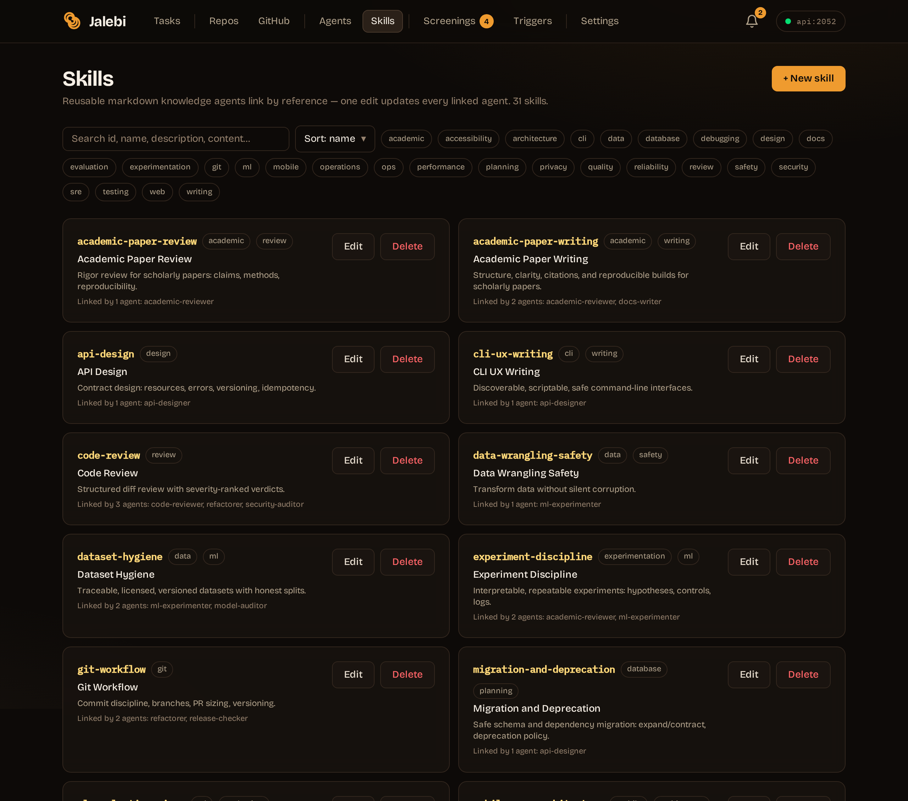

# 🦦 Jalebi

### Your repos, on your command. Your own coding-agent dashboard.

**Jalebi is a private, self-hosted, localhost-only web app that works like Google's Jules: connect your GitHub account, create tasks (fix issue, review PR, implement feature, audit security), watch the agent work through a live step-by-step timeline, and follow up in the same session.**

[](https://samosa-ai.com/jalebi) [](https://samosa-ai.com/jalebi/docs) [](https://discord.com/invite/rsgXSpcWNq) [](https://github.com/samosa-ai-com/Jalebi/releases/latest) [](LICENSE)

`Python 3.13 + Flask` · `React + Vite + Tailwind` · `opencode / Codex / Claude Code` · `Localhost only` · `One port: 2052`

---

Most dashboards show you work — **Jalebi does it**. 🤖

Say *"fix #42 on my API repo"*, *"review PR #7"*, or *"audit the development branch over the weekend"*. Jalebi spins up the agent in an isolated git worktree, streams every step to a live timeline, opens (or updates) a PR with `Closes #N`, and can even start reviewing the moment a PR opens via webhooks. 📋

Everything runs in **one app on your own machine**. It automatically uses every coding CLI already configured on your system (`opencode`, `codex`, `claude`) — nothing to reinstall, nothing new to configure, no new subscription: it rides the subscriptions you already have. Connect your GitHub account once on the GitHub page (stored in a local `0600` vault, never synced) — your code never leaves your network except through the GitHub API calls you approve. 🔑

## 🏁 Getting started

> **Linux only at the moment** — Jalebi is developed and tested on Linux. macOS/Windows (including WSL) are untested and unsupported for now.

Grab the latest release from [**GitHub Releases**](https://github.com/samosa-ai-com/Jalebi/releases/latest), or build from source 👇

```bash
git clone https://github.com/samosa-ai-com/Jalebi.git
cd Jalebi
uv sync --project apps/server
npm install
cp -n .env.example .env
sed -i 's/^JALEBI_PASSWORD=.*/JALEBI_PASSWORD=pick-a-strong-password/' .env   # replace with your own password (required)
npm run build
./start.sh
```

Then open `http://127.0.0.1:2052`, add your GitHub account on the **GitHub page** (stored in `<data-dir>/secrets.json`, mode `0600`), connect a repo, and create your first task. Full setup notes live in [`docs/00-overview.md`](docs/00-overview.md) and the [docs site](https://samosa-ai.com/jalebi/docs).

### ⚡ One-line install

```bash
git clone https://github.com/samosa-ai-com/Jalebi.git && cd Jalebi && uv sync --project apps/server && npm install && cp -n .env.example .env && sed -i 's/^JALEBI_PASSWORD=.*/JALEBI_PASSWORD=pick-a-strong-password/' .env && npm run build && ./start.sh
```

Replace `pick-a-strong-password` with your own password first if you like (the server refuses to start when it is empty). Open `http://127.0.0.1:2052` when it's up. Stop anytime with `./stop.sh`.

### 🤖 Agentic install (paste this into your coding agent's CLI)

Copy the block below, paste it into your agent (opencode / Codex / Claude Code), and it will set up Jalebi on your machine by itself:

```text
Clone https://github.com/samosa-ai-com/Jalebi.git into ./Jalebi (skip if already cloned).
Read Jalebi/AGENTS.md first and follow it exactly — it is the mandatory entry point.
Then read docs/00-overview.md and JALEBI_PRD.md for behavior.
Set up: `uv sync --project apps/server`, `npm install` at repo root, `cp -n .env.example .env`, `npm run build`, `./start.sh`.
Verify GET /api/health returns {"status":"ok"} on port 2052.
Ask me for JALEBI_PASSWORD and my GitHub PAT when you need them. Never commit, print, or log secrets.
Report what you did, test/build results, and what to open in the browser.
```

## 🌟 Highlights

- **🧰 Task queue that does real work** — issue fixes, PR reviews, free-form instructions, security audits. Concurrency 4, cancel/timeout/retry, per-run logs and artifacts.
- **🎭 Zero-config backends, switched on the go** — automatically uses the coding CLIs already configured on your system (opencode, Codex, Claude Code), chosen **per action** (each task/follow-up/screen/agent form has its own Backend + Model selects); Settings `default_backend`/`default_model` are just fallbacks. No reinstalls, no new subscription — your existing CLI subscriptions cover it.
- **🔍 Live timeline, diff & history** — watch each step stream in, inspect the incremental diff, walk the task history, resume the same agent session with follow-ups.
- **👀 Reviewer workflow** — catalog reviewers run in their own worktrees and post real PR review comments; "address reviewers" rolls findings into a follow-up.
- **⚡ Event-driven triggers** — repo webhooks auto-start work the moment a PR opens (deduped, rule-based, with registration + replay).
- **🔮 Proactive screening** — scheduled, notify-only audits with HEAD-baseline dedup, findings JSON, and ntfy tap-links. Never auto-acts.
- **🛡️ Merge gating** — commit statuses per task so branch protection can block merges until Jalebi is green.
- **🏠 Catalog agents & env vars** — named personalities (markdown → `AGENTS.md`) + skills + optional model/CLI; global + per-repo env-var store with blocklist + masking.
- **🛡️ Safety by design** — localhost-only, PAT vault, secret masking at ingest, `gh` CLI hard-blocked three ways, agent sandboxing. → [Security](SECURITY.md)

## ⚖️ Why Jalebi is different

Every other reviewer ships **its own AI harness in someone else's cloud**. Jalebi ships **no harness at all** — it automatically uses every coding CLI already configured on your system, so there is zero setup, zero reinstalls, and zero new subscriptions: it rides the subscriptions you already have, and the backend + model can be switched **per action, on the go** (each task, follow-up, screen, and agent form has its own selects). No other tool in the comparison below works this way.

And it is still a full-power agent, not a comment bot: it clones into isolated per-task worktrees, runs with full power and network access for its backends, opens and updates real PRs (`Closes #N`), follows up in the same agent session, auto-starts reviews from webhooks, runs scheduled notify-only audits, and gates merges with commit statuses — while your code stays on your machine (only GitHub API calls and your chosen model provider ever see it), filesystem isolation holds per task, and GitHub-level guards (PAT vault, masking, `gh` ban, publish guards) hold per action. 🆓 FREE (AGPL-3.0) with UNLIMITED tasks, repos, and runs — private, and yours.

|  | **🦦 Jalebi** | **Google Jules** | **CodeRabbit** | **Greptile / Qodo Merge / Copilot review** | **Open-source (PR-Agent, Reviewdog, Danger)** |
|---|---|---|---|---|---|
| Hosting & privacy | ✅ Self-hosted, localhost-only. Code stays local except GitHub API + your provider | ❌️ Google Cloud VM. Code leaves your machine for Google's cloud | ❌️ Vendor cloud. Code goes through CodeRabbit's cloud (no self-host) | ⚠️ Vendor cloud (enterprise self-host/VPC on top tiers only) | ✅ Self-hosted. You run it, you hold the code |
| AI harness | 🏆 **None — auto-uses your already-configured CLIs. Zero setup, zero reinstalls** | ❌️ Google's own harness, Gemini-only | ❌️ Their harness, their models | ❌️ Their harness, their models | ⚠️ PR-Agent: BYO API keys, one LLM call per command. Reviewdog/Danger: linter orchestration, no AI reasoning |
| Model choice | 🏆 **Any model your CLI offers, switched per action on the go** | ❌️ Gemini 2.5/3 Pro, Google's call | ❌️ Vendor's models | ❌️ Vendor's models | ⚠️ Whichever key you plug in — one provider per setup |
| Price & license | 🏆 **FREE, AGPL-3.0 — UNLIMITED tasks, repos & runs. No seats, no tiers, no new subscription** | ⚠️ Free tier (15 tasks/day) → 💰 paid AI Pro/Ultra | 💰 Per-seat SaaS, free for public repos only | 💰 Per-seat SaaS / bundled with paid Copilot | 🆓 Free, open source (paid hosted tiers exist) |
| Beyond comments | 🏆 Tasks, follow-ups, reviewer worktrees, triggers, screening, publish, merge gating | ⚠️ Async tasks → PRs | ⚠️ Summaries, walkthroughs, inline comments, one-click fixes | ⚠️ Inline comments, suggestions, policy gates | ⚠️ `/review` `/improve` `/ask` commands, autofixes |
| Isolation & GitHub safety | ✅ Per-task worktrees + PAT vault + masking + `gh` ban + publish guards | ✅ Google's VM sandbox | ⚠️ Vendor sandbox + GitHub App permissions | ⚠️ Vendor sandbox + GitHub App permissions | ⚠️ Your infra, your responsibility |

**Legend:** 🏆 = better-than-everything-else on this row (Jalebi only) · ✅ = strength · ⚠️ = caveat / partial · ❌️ = missing or the opposite · 🆓 = free · 💰 = paid.

The same cloud-SaaS shape also covers the rest of the popular field — Graphite (stacked-PRs + bundled review, GitHub-only), CodeAnt, Snyk Code, DeepSource, SonarQube, Korbit, Bito/Cursor Bugbot: proprietary harness, vendor models, per-seat pricing, code through their cloud. Jalebi is the only entry above with no harness, no cloud, no seat to buy — 🆓 FREE with UNLIMITED tasks, repos, and runs.

> Facts as of Sep 2026; competitor pricing and limits change — see [Jules](https://jules.google/), [CodeRabbit](https://www.coderabbit.ai/), [Greptile](https://www.greptile.com/), [Qodo](https://www.qodo.ai/), [Copilot code review](https://docs.github.com/copilot), [PR-Agent](https://github.com/qodo-ai/pr-agent). Jalebi's trade-off is stated plainly: single-owner, localhost-only, GitHub-only, Linux-only — it gives up multi-user/cloud convenience for privacy and control.

## 📸 Screenshots

> From a local Jalebi instance (Linux, dark theme) — captured at 2×. **Click any shot to open it full-size.**

<table>
  <tr>
    <td width="50%" valign="top">
      <a href="docs/assets/screenshot-tasks.png"></a>
      <br><sub><b>Task queue &amp; new task</b> — every task, its backend/model, and the exact publish mode.</sub>
    </td>
    <td width="50%" valign="top">
      <a href="docs/assets/screenshot-detail.png"></a>
      <br><sub><b>Task detail</b> — prompt, publish-readiness checks, and reviewer assignment.</sub>
    </td>
  </tr>
  <tr>
    <td width="50%" valign="top">
      <a href="docs/assets/screenshot-streaming.png"></a>
      <br><sub><b>Live streaming</b> — streamed agent steps (Timeline) beside the raw terminal output (Console).</sub>
    </td>
    <td width="50%" valign="top">
      <a href="docs/assets/screenshot-followup.png"></a>
      <br><sub><b>Follow-up</b> — resume the same agent session with its own backend/model; the run continues where it left off.</sub>
    </td>
  </tr>
  <tr>
    <td width="50%" valign="top">
      <a href="docs/assets/screenshot-mission-control.png"></a>
      <br><sub><b>Mission Control · Ops Deck</b> — runner rails, per-core worker terminals, dispatch, metrics, and the live event stream.</sub>
    </td>
    <td width="50%" valign="top">
      <a href="docs/assets/screenshot-halwai.png"></a>
      <br><sub><b>Mission Control · Halwai</b> — the same control room in the alternate themed skin.</sub>
    </td>
  </tr>
  <tr>
    <td width="50%" valign="top">
      <a href="docs/assets/screenshot-agents.png"></a>
      <br><sub><b>Agent catalog</b> — named personalities (<code>AGENTS.md</code>), skills, and optional CLI/model pins.</sub>
    </td>
    <td width="50%" valign="top">
      <a href="docs/assets/screenshot-skills.png"></a>
      <br><sub><b>Reusable skills</b> — markdown knowledge referenced by agents; one edit updates them all.</sub>
    </td>
  </tr>
</table>

## 📚 Documentation

- 🚀 [**Getting Started**](https://samosa-ai.com/jalebi/docs/getting-started) — install, add your PAT, connect a repo, run your first task.
- 🏗️ [**Architecture**](docs/01-architecture.md) — components, data flow, SSE.
- 🗄️ [**Data model**](docs/02-data-model.md) — SQLite schema + relationships.
- 🔌 [**Adapters**](docs/03-adapters.md) — opencode / Codex / Claude Code interface, parsing, quirks.
- 🌿 [**Git workspaces**](docs/04-git-workspace.md) — mirrors, worktrees, branch naming, token-authenticated push.
- 🐙 [**GitHub integration**](docs/05-github-integration.md) — httpx client, PAT scopes, webhooks, check runs.
- 📬 [**Task queue**](docs/06-task-queue.md) — workers, run lifecycle, publish.
- 🔎 [**Screening**](docs/07-screening.md) — engine, cron, dedup, findings, ntfy.
- 🖥️ [**UI**](docs/08-ui.md) — React pages, components, SSE consumption.
- 🧪 [**Testing**](docs/09-testing.md) — strategy per layer, fixtures, how to run.
- 🔐 [**Security**](docs/10-security.md) — binding, secrets, masking, sandboxing.
- 📖 Full index lives in [`docs/`](docs/) — start at [`docs/00-overview.md`](docs/00-overview.md). The spec of record is [`JALEBI_PRD.md`](JALEBI_PRD.md).

## ⚙️ Configuration

| Variable | Required | Purpose |
|----------|----------|---------|
| `JALEBI_PASSWORD` | Yes | UI password. The server refuses to start when empty. |
| `JALEBI_GITHUB_TOKEN` | No | Masking-only. Real accounts are added via the GitHub page UI (named vault). Setting this only adds it to the log-redaction list. |
| `JALEBI_PUBLIC_URLS` | No | `Label=url` list for notification tap-links (LAN, Tailscale, tunnel…). Unset → `127.0.0.1` links. |
| `JALEBI_DATA_DIR` | No | Data dir (defaults to `~/.jalebi`). |
| `JALEBI_HOST` / `JALEBI_PORT` | No | Bind address/port (defaults `0.0.0.0` / `2052`). |

Dev alternatives: `npm run dev` (server + web), `npm run dev:web` (Vite hot-reload), `uv run --project apps/server jalebi`.

## 🛠️ Development

**This repo is optimized for agentic-coding workflows.** You can develop Jalebi with your own coding harness — no special setup. Best practice is to point it at [`AGENTS.md`](AGENTS.md) and tell it what to do:

```text
Read AGENTS.md in this repo and follow it exactly. <what you want, e.g. "fix issue #12" / "implement <feature>" / "review PR #7">
```

Why this works:

- `AGENTS.md` is the **mandatory entry point**: project map, PAT-only GitHub rules (`gh` CLI banned), per-action backend+model selection, plan-first contract.
- `JALEBI_PRD.md` is the **authoritative behavior spec** (PRD wins over code/docs/instinct on conflicts).
- `docs/` is the per-topic companion (architecture, data model, adapters, git workspaces, GitHub integration, queue, screening, UI, testing, security, reliability, catalog, triggers, env vars).
- `HANDOFF.md` stays local (git-ignored) — your agent keeps its own working notes there.

Checks before every PR (see [`CONTRIBUTING.md`](CONTRIBUTING.md)): `uv run --project apps/server pytest` · `uv run ruff check` · `npm run test -w @jalebi/web` · `npm run lint` · `npm run build`.

## 🤝 Project & community

- 💬 [**Discord**](https://discord.com/invite/rsgXSpcWNq) — chat with the team and other users and get help in real time.
- 🗣️ [**GitHub Discussions**](https://github.com/orgs/samosa-ai-com/discussions) — feature ideas, Q&A, longer-form conversations.
- 🐛 [**Issues**](https://github.com/samosa-ai-com/Jalebi/issues) — bug reports and feature requests.
- 💡 [**Contributing**](CONTRIBUTING.md) — branching strategy, checks to run, and how to add adapters/screens:
  `uv run --project apps/server pytest` · `uv run ruff check` · `npm run test -w @jalebi/web` · `npm run build`
- 🛡️ [**Security Policy**](SECURITY.md) — how we handle vulnerabilities and where to report them privately (`contact@samosa-ai.com`).
- ⚖️ [**License**](LICENSE) — released under AGPL-3.0. Copyright © 2026 Samosa AI.

> Warning
>
> **Use Jalebi responsibly and at your own risk.** It drives coding agents that clone repos, create branches, push commits, open PRs, and post review comments on your behalf. Models can hallucinate, misread instructions, or push unexpected changes. Start on a scratch repo, review every diff before publishing, grant PAT scopes carefully, and keep backups. We assume no liability for any loss or damage incurred through use of Jalebi.
